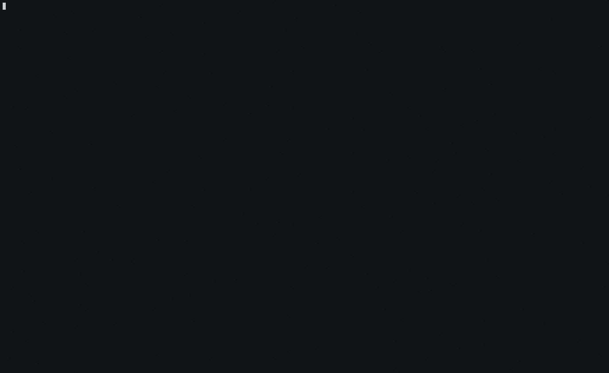

# ssm-multi-tmux  
Run an interactive AWS SSM command in synchronised tmux panes on one or more EC2 instances by specifying the autoscaling group name or tag key and value.  
  
## Getting Started  
These instructions will help you setup the script on your local machine. See usage for further information.
  
### Prerequisites  
The following must be installed:
 - `tmux` (https://github.com/tmux/tmux)
 - `aws`  (https://docs.aws.amazon.com/cli/latest/userguide/install-cliv2-linux.html#cliv2-linux-install)
 - `session-manager-plugin` (https://docs.aws.amazon.com/systems-manager/latest/userguide/session-manager-working-with-install-plugin.html#install-plugin-linux)

  
### Installing  
Clone this repo or download `multissm.sh` script
```
git clone git@github.com:elpy1/ssm-multi-tmux.git
```  
  
Copy the script to a local `bin` directory  
```  
cp ssm-multi-tmux/multissm.sh ~/.local/bin  
```
  
Ensure directory is in your `PATH`
```  
echo "PATH=$HOME/.local/bin${PATH:+:${PATH}}" >> ~/.bashrc
```
  
## Usage  
The script can be used by specifying either an EC2 autoscaling group name or the tag key and tag value of your target instances, as well as the command to run on the remote instances. Ensure AWS environment variables are available via your tool of choice e.g. `AWS_PROFILE` or `AWS_ACCESS_KEY_ID`, `AWS_SECRET_ACCESS_KEY` and `AWS_SESSION_TOKEN`
```
Usage: multissm.sh [-h] [-t <key>] -v <value> | -a <asg name> [--] <command>  
Try 'multissm.sh --help' for more information.
```

### Connect to EC2 instances in an autoscaling group
`htop` on instances in autoscaling group **wordpress-prod**:
  
```  
multissm.sh --asg wordpress-prod htop
```
  
tail `httpd` journal log output on instances in autoscaling group **drupal-web-asg**:
```
multissm.sh --asg drupal-web-asg -- journalctl -f -u httpd
```
  
### Connect to EC2 instances with specific tag
Execute `bash` on instances with a tag key of **Name** and tag value of **prod-internal-cms02**:
```
multissm.sh --tag Name --value prod-internal-cms02 -- bash 
```
   
output `date` every second  on instances with tag key **app-server** and tag value **drupal-frontend**:
```
multissm.sh --tag app-server --value drupal-frontend -- watch -t -n1 date +%s 
```
## Demo  
executing `htop` on an autoscaling group containing 4 instances

  
## Authors  
* **elpy1** - https://github.com/elpy1  
  
## License  
This project is licensed under the MIT License - see the [LICENSE](LICENSE) file for details
